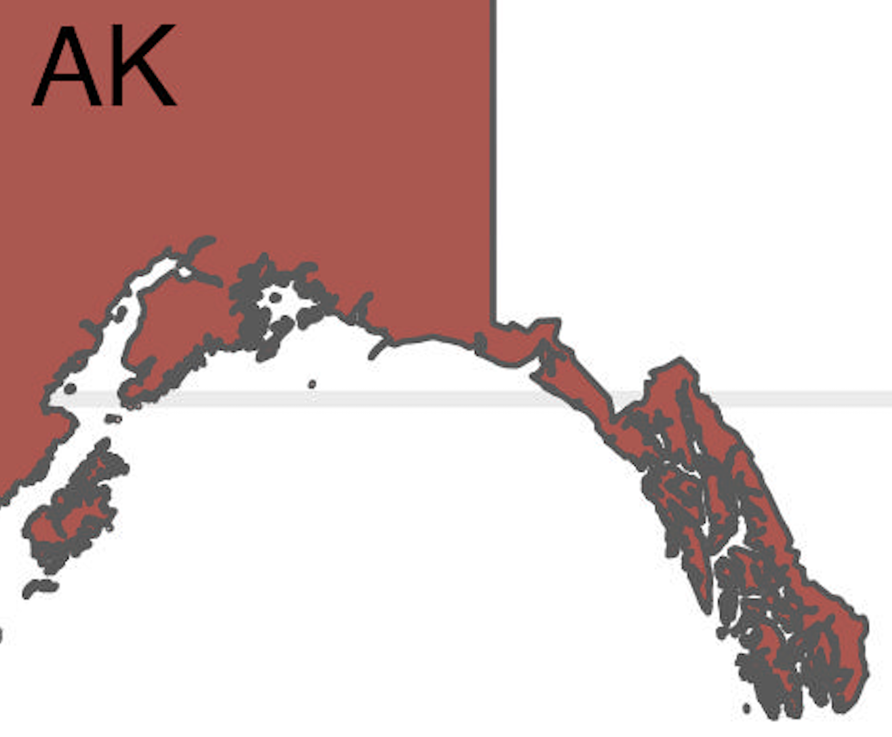
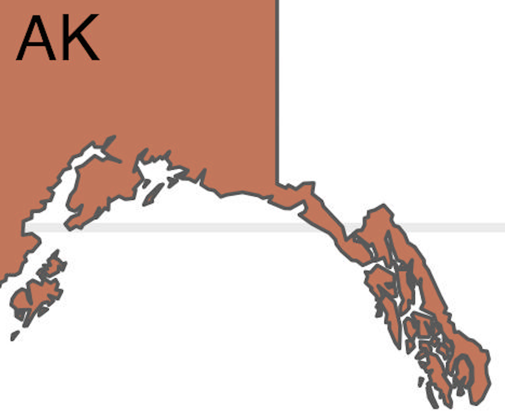

## Simplification

The `rmapshaper` was used to simplify the polygons. Since the states are assuming a value, there's no need for intricate details.  The reader will know that Alaska and all of its islands are one state and they have a single value.  The author of the package uses the "Visvalingam" simplification "because it generally does a better job of removing details that are too small to be displayed clearly." You can go to the website <https://mapshaper.org> and upload the map there, choose a algorithm to simplify and then use a slider for the level of simplification.  For this project, Visvalingham was chosen at an 8% level.  The 8% level dropped the Florida keys but gave decent resolution of the Hawaiian islands and the Aleutian island chain. File size was dramatically reduced.

|Before|After|
|-----|-----|
|||
