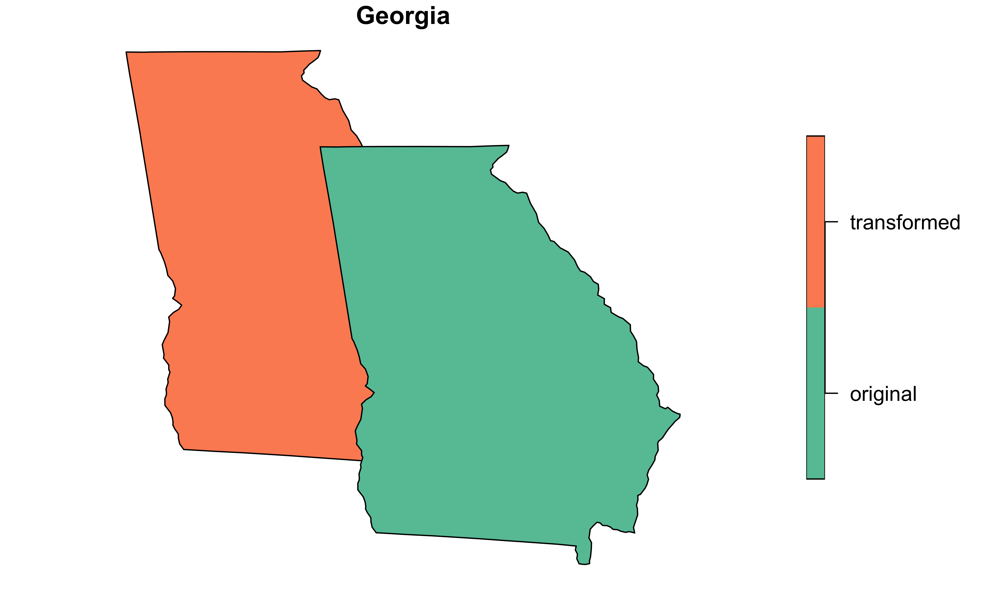
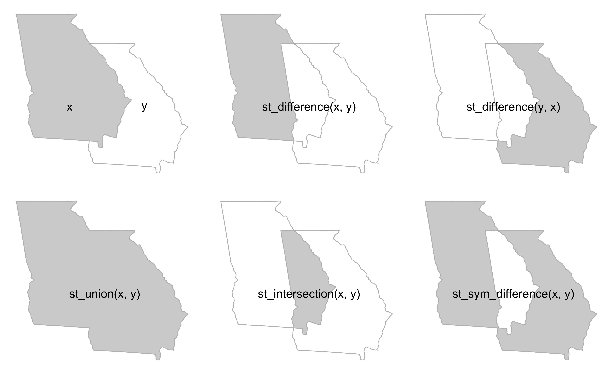

```{r}
#| label: load-libraries
#| include: false
library(sf)
library(ggplot2)
library(magrittr)
library(dplyr)
library(rnaturalearth)
here::i_am(path = "basics/01-basics.qmd")
```

# File Operations

## Import GIS

There are multiple formats.  This example uses a "shapefile".  It would be more accurate to refer to them as "shapefiles" because it is comprised of a directory of files. This shapefile was downloaded from the [U.S. Census Cartographic Boundary Files](https://www.census.gov/geographies/mapping-files/time-series/geo/cartographic-boundary.html). This is the "state" file and its scale is 1:20m.

```{r}
#| label: basic-import
layer <- "cb_2023_us_state_20m"
dsn <- here::here("data/cb_2023_us_state_20m")
us <- sf::st_read(dsn = dsn, layer = layer)
results <- capture.output(sf::st_read(dsn = dsn, layer = layer))
```

Careful reading of the above output tells you important information about the file. For the sake of speed, it may be tempting to skip this crucial information. The better advice is to review it carefully.

::: {.callout-note}
A thorough understanding of import options can save a programmer a lot of time later in an analysis.  The `st_read()` function contains many arguments allowing for flexibility on import.  Note that all geometries are converted to the "Multi" variety. For example, polygons become multipolygons.  If this is undesired behavior, then set `promote_to_multi = F`.
:::

## Export GIS

```{r}
#| label: basic-export-gis
#| warning: false
if(!dir.exists("./data/us")) dir.create(path = "./data/us", recursive = TRUE)
dsn <- here::here("data/us/us.shp")
sf::st_write(us, dsn = dsn, append=FALSE)
```

## Get Info

Within the Rstudio viewer, the file behaves much like any dataframe or tibble. That feeling is intentional.  The author's of the `sf` package have worked hard to preserve a `dplyr` like workflow so that programmers don't have to learn new skills.  However, this is not your typical dataframe!

### Class

The object is both a dataframe and of the "sf" class.

```{r}
#| label: basic-class
class(us)
```

### Attributes

```{r}
#| label: basic-attr
attributes(us)
```


### Dependencies

Software dependencies can cause lots of headaches when incompatiable or out dated.  You can see the complementary software along with the versions by running the command below.


```{r}
#| label:  basic-dependencies
sf::sf_extSoftVersion()
```

### CRS

A Coordinate Reference System (CRS) tells the computer how the coordinates were calculated. This is a topic of importance, but generally it should just work.  Don't change it unless you're confident in what you're doing.

```{r}
#| label:  basic-crs-1
sf::st_crs(us)[[1]]
```

"NAD83" is an abbreviation for the "North American Datum of 1983".

```{r}
#|label: basic-crs-2
cat(sf::st_crs(us)[[2]], sep = "\n")
```


### Bounding Box

A "bounding box" gives the range (minimum and maximum) along the two axes. The coordinates were printed to the console when the object was imported initially, but can be accessed via `st_bbox`.

```{r}
#| label:  basics-bounding-box
sf::st_bbox(us)
```


### Geometry Column

The spatial portion of the dataframe is stored in a column within the dataframe.  Usually, this column is named "geometry" and can be accessed via `object$geometry`.  However, a more conventional way is the following:

```{r}
#| label:  basic-geometry
sf::st_geometry(us)
```

### Validity

A simple way to check if the geometries were imported correctly is to run the following command:

```{r}
#| label: basic-check-validity
all(sf::st_is_valid(us))
```


Note that 52 rows of the dataframe generated a "TRUE" response, meaning that they are all valid.  In the event of a "FALSE", the function `sf::st_make_valid` might fix the problem.

### Plot

Many authorities recommend doing a quick plot. A quick plot will help discover if the correct file was downloaded or if there are any additional problems with the data.

For a quick plot, my default command is:

```{r}
#| label:  fig-basics-quick-plot
#| fig-cap: "Map of United States with Aleutian Island chain broken across longitude."
#| eval: false
plot(us["NAME"], axes = T)
```

The map looks to be the correct map and there were no errors when plotting. Looking at the 52 names in the `NAME` field reveal Washington D.C and Puerto Rico are included.  There are no additional states at the 150E 55N location.  This suggests that some of the Aleutian Islands in Alaska have breached a division within the map.
Here's a re-plot where the longitudinal center of the map is shifted -90 degrees. The `sf` package also includes the `st_shift_longitude` function for a similar result.

```{r}
#| label: fig-basics-quick-plot-recenter
#| fig-cap: "Map of United States with longitude rotated -90 degrees."
#| warning: false
#| message: false
us["NAME"] |> st_break_antimeridian(lon_0 = -90) |> 
     st_transform('+proj=longlat +ellps=WGS84 +datum=WGS84 +no_defs +lon_0=-90') |> 
    plot(axes = T)
```


# Geometry Creation

The workflow to creating an `sf` class object is:
`sfg >> sfc >> sf`. An `sf` class object contains both geometries and data called attributes.

## SFG

The `sfg` class represents simple feature geometries.  There are 17 possible geometry types. We will discuss `LINE`, `POINT`, `POLYGON`/`MULTIPOLYGON` and only in 2-dimensional space.  All features are built upon points.


### Point

```{r}
#| label: basics-sfg-point
(pt <- sf::st_point(c(0, 0)))
class(pt)

```

### Line

```{r}
#| label: basics-sfg-line
(line <- sf::st_linestring(rbind(c(0, 0), c(1, 0))))
class(line)
```

### Polygon

Note that the final point is a repeat of the first point in order to close the polygon.

```{r}
#| label: basics-sfg-polygon
(plgn <- sf::st_polygon(list(rbind(c(0,0), c(0,1), c(1,1), c(1,0), c(0,0)))))
class(plgn)
```

### Plot

```{r}
#| label: basics-plot-sfg
#| include: false
library(ggplot2)
plt_pt <- pt |> 
    ggplot() + 
    geom_sf(col = "green", size = 5) + 
    annotate("text", x = 0, y = .2, label = "point") + 
    theme_void() + scale_y_continuous(limits = c(-1, 1)) +
    scale_x_continuous(limits = c(-1, 1))
plt_line <- line |> ggplot() + geom_sf(col = "blue", lwd = 2) + scale_y_continuous(limits = c(-.5, .5)) + theme_void() +annotate("text", x = .5, y = .1, label = "line")
plt_plgn <- plgn |> ggplot() + geom_sf(col = "red", lwd = 2) + theme_void() + annotate("text", x = .5, y = .55, label = "polygon")
```

```{r}
#| label: fig-basics-plot-sfg-arrange
#| fig-cap: "Examples of simple feature
#|  geometries."
#| echo: false
cowplot::plot_grid( plt_pt, plt_line, plt_plgn, ncol = 3)
```

## SFC

Next a geometry is included in a simple feature column. A simple feature column is a column-list of `sfg` objects. It might be a little confusing because in the example below there is only a single `sfg` object that is then converted to a list-column.

```{r}
#| label: basic-sfc-pt
beijing_sfg <- sf::st_point(c(116.4, 39.9))
class(beijing_sfg)
(beijing_sfc <- sf::st_sfc(list(beijing_sfg),crs = "WGS84"))
class(beijing_sfc)
```

## SF

```{r}
#| label: basic-sf-pt
city <- "Beijing"
country <- "China"
(beijing_sf <- sf::st_sf(city = city,
                    country = country,
                    beijing_sfc))
```

## Plot

```{r}
#| label: fig-beijing-plot
#| fig-cap: "Map of China with Beijing shown as blue point."
chn <- rnaturalearth::ne_countries(country = "China")
plot(chn$geometry, axes = T)
plot(beijing_sfc, add = T, cex = 2, col = "steelblue", pch = 16)
```

# CRS

## Coordinate Reference Systems

- The earth is not a perfectly round sphere.  Matter of fact, if one measures the circumference of the earth  between the North and South poles, the measurement would be 11.5 kilometers shorter than the circumference of the equator.  The earth is an ellipsoid rather than a sphere. An accurate Coordinate Reference System must account for these nuances.

-  Coordinate Reference System (CRS), which defines how the spatial elements of the data relate to the surface of the Earth (or other bodies). CRSs are either geographic or projected. [@lovelace_geocomputation_2019; @moraga_spatial_2023]

- Geographic CRS use latitude and longitude; projected CRS use Cartesian coordinates to reference a two-dimensional or flat representation of the earth.  

## Geographic CRS

- Geographic CRS use latitude and longitude to identify unique positions on the Earth's surface. By way of reminder, the equator runs east and west, bisecting the Earth into the Northern and Southern hemispheres. It is halfway between the North and South poles. The equator's latitude is equal to 0 degrees.

- Latitude values are the angle values north or south of the equator (0 degrees) and range from –90 degrees at the south pole to 90 degrees at the north pole.

- The prime meridian is an arbitrarily-chosen meridian running North and South, dividing the Earth into Eastern and Western hemispheres.Earth's current international standard prime meridian is the International IERS Reference Meridian. The current standard differs from the previous Greenwich Meridian.

- Longitude values range from –180 degrees when running west to 180 degrees when running east 

- The latitude and longitude values where the Equator and Prime Meridean insersect is (0, 0).

- Latitude and longitude coordinates may be expressed in degrees, minutes, and seconds, or in decimal degrees. In decimal form, northern latitudes are positive, and southern latitudes are negative. Also, eastern longitudes are positive, and western longitudes are negative. 

| Format | Latitude | Longitude
|-----|------|------|

```{r}
#| label: basic-map
#| warning: false
#| echo: false
wrld <- ne_countries(type = "countries", scale = "small")
wrld |> 
    ggplot() +
    geom_sf(fill = "antiquewhite") +
    coord_sf(crs = sf::st_crs("EPSG:4283"),
             expand = FALSE) +
    geom_vline(
        xintercept = 0, 
        color = "steelblue", 
        linetype = "dashed", 
        linewidth = .75
    ) +
    geom_hline(
        yintercept = 0, 
        color = "steelblue", 
        linetype = "dashed",
        linewidth = .75
    ) +
    annotate("text", x = 160, y = 5, label = "Equator") +
    annotate("text", x = -0, y = 75, label = "Prime Meridian") +
    scale_y_continuous(name = "Latitude",
                       breaks = seq(-90, 90, by = 30)) +
    scale_x_continuous(name = "Longitude",
                       breaks = seq(-180, 180, by = 30)) +
    theme_bw() +
    theme(
        panel.grid.major = element_line(
            color = gray(.5),
            linetype = "dotted",
            linewidth = 0.25
            ),
        panel.background = element_rect(
            fill = "aliceblue"
            )
    )
```

- "Taken together, the geodetic datum (e.g, WGS84), the type of map projection (e.g., Mercator) and the parameters of the projection (e.g., location of the origin) specify a coordinate reference system, or CRS, a complete set of assumptions used to translate the latitude and longitude information into a two-dimensional map." (hadley)

```r
#obtain CRS info from object 
sf::st_crs(us_map)
```

- The WKT format will usually start with a PROJCRS[...] tag for a projected coordinate system, or a GEOGCRS[...] tag for a geographic coordinate system. The CRS output will also consist of a user defined CS definition which can be an EPSG code, or a string defining the datum and projection type. In the past, a coordinate system could be defined by its EPSG numeric code or the PROJ4 formatted string. Now, an sf object’s coordinate system can also be designated with Well Known Text (WTK/WTK2) format. "When possible, adopt an EPSG code which comes from a well established authority. However, if customizing a coordinate system, it may be easiest to adopt a PROJ4 syntax."[@gimond_intro_2023]

## Projections

- All projected CRSs are based on a geographic CRS.  A projection takes a three-dimensional object, the earth, and reduces it to a two-dimensional object. The conversion always results in deformation. 

- There are three types of projections: conic, cylindrical, and planar (azimuthal). Conic projections are appropriate for maps of mid-latitude areas. Cylindrical projections are used when displaying the entire world. (The "Mercator" map, by Gerardus Mercator back in 1569, is an example). A planar projection is typically used in mapping polar regions. 

- "Projections are often named based on a property they preserve: equal-area preserves area, azimuthal preserve direction, equidistant preserve distance, and conformal preserve local shape."[@lovelace_geocomputation_2019]


> "you will have to make choices about what distortions you are prepared to accept when drawing a map. This is the job of the map projection."

> “North American Datum” (NAD83) is a good choice, whereas if your perspective is global the “World Geodetic System” (WGS84) is probably better.

> When selecting geographic CRSs, the answer is often WGS84. It is used not only for web mapping, but also because GPS datasets and thousands of raster and vector datasets are provided in this CRS by default. WGS84 is the most common CRS in the world, so it is worth knowing its EPSG code: 4326.  Lovelace.

```
# to see list of available projections
sf_proj_info(type = "proj")
```


Upon import, most objects will have a CRS already set.  The challenge is to know what CRS you're working with and for it to match in all layers of the map. Occassionally, a need to "transform" the CRS will arise. We'll use the United States GIS data from the U.S Census bureau.

## Query

### User Input

The user input element can contain the AUTHORITY:CODE representation (e.g., EPSG:4326), the CRS’s name (e.g., WGS 84), or the proj-string definition (e.g., “+proj=lcc +lat_1=20 +lat_2=60 lon_0=-96 +datum=NAD83 +units=m”). 

```{r}
#| label: basics-crs-query-us-1
sf::st_crs(us)[[1]]
sf::st_crs(us)$IsGeographic # geographic or projected?
sf::st_crs(us)$units_gdal # meters or degrees?
sf::st_crs(us)$proj4string # proj string
```

### WKT

"WKT" is an abbreviation for "well known text string".
```{r}
#| label: basics-crs-query-us-2
cat(sf::st_crs(us)[[2]], sep = "\n")
```

## Transform

Use the CRS that is best for your work. However, keep this in mind prior to conversion:

> When selecting geographic CRSs, the answer is often WGS84. It is used not only for web mapping, but also because GPS datasets and thousands of raster and vector datasets are provided in this CRS by default. WGS84 is the most common CRS in the world, [so it is worth knowing its EPSG code: 4326]{bg-colour="#ffe536"}. This ‘magic number’ can be used to convert objects with unusual projected CRSs into something that is widely understood.[@lovelace_geocomputation_2019]

```{r}
#|label: basics-crs-transform
us_wgs84 <- sf::st_transform(us, "EPSG:4326")
sf::st_crs(us_wgs84)
```


::: {.callout-tip}
### Finding CRS
Finding the right CRS for your project can be a challenge.  In researching this project, I discovered the `crsuggest` package, available [here](), and this [website](https://crs-explorer.proj.org/).
:::

A helpful package is the `crsuggest`package which can be installed from CRAN: `install.packages("crsuggest")`. An example would be New Zealand.  When exported from the `rnaturalearth` package, it is in the common "WGS 84" format. Because of its proximity to the South Pole, this can cause distortions and a better CRS may be available.

```{r}
#| label: basics-crs-find
rnaturalearth::ne_states(country = "New Zealand") |> 
    crsuggest::suggest_crs()
```

# Operations - Attributes

This section deals with typical dataframe manipulations like subsetting, filtering and creating new columns with vector datasets. Let's continue to use the `us` dataframe of class `sf`. I prefer to work in a pipline using the `dplyr` package so the `base` package equivalents will be omitted.

## Drop Geometry

The original `us` dataframe has 10 columns, one of which is a geometry list column. Once dropped, the new dataframe has 9 columns.

```{r}
#basics-attr-drop
setequal(ncol(sf::st_drop_geometry(us)), ncol(us))
```

## Filter

```{r}
#| label: basics-attr-filter
us |> 
    dplyr::filter(NAME %in% c("Texas", "California"))
```

## Select

```{r}
#| label: basics-attr-select
us |> 
    sf::st_drop_geometry() |> 
    dplyr::filter(NAME %in% c("Texas", "California")) |> 
    dplyr::select(NAME, ALAND)
```

## Slice

```{r}
#| label: basics-attr-slice
us |> 
    sf::st_drop_geometry() |> 
    dplyr::select(NAME, ALAND) |> 
    dplyr::arrange(dplyr::desc(ALAND)) |> 
    dplyr::slice_head(n = 5)
```

## Summarize

This example divides states into big and small depending if their area exceeds the average. Then, it computes the average by big and small.  The geometry column stays with the dataframe until droped in the last line.

```{r}
#| message: false
library(dplyr)
library(magrittr)
us |> 
    mutate(avg_lnd = mean(ALAND), .after = ALAND) |> 
    mutate(typ_lnd = ifelse(ALAND > avg_lnd, "big", "small"), .after = avg_lnd) |>
    group_by(typ_lnd) |> 
    summarize(avg_lnd_typ = mean(ALAND)) |> 
    sf::st_drop_geometry()

```

# Operations - Geometric


## Boundary

The `st_boundary` function will convert the geometry type from multipolygon to linestring.

```{r}
#| label: fig-basics-opgeo-bndry 
#| fig-cap: "Map of New Mexico, Oklahoma, and  Texas with border layer widened for emphasis."
swus <- us[us$NAME %in% c("Texas", "Oklahoma", "New Mexico"), "geometry"]
bndry_swus <- sf::st_boundary(us[us$NAME %in% c("Texas", "Oklahoma", "New Mexico"), ])
plot(swus$geometry, col = c("red", "steelblue", "yellow"), main = "Southwest US", axes = T)
plot(bndry_swus$geometry, add = T, lwd = 5, col = "grey20")
```

## Buffer

```{r}
#| label: fig-texas-buffer
#| fig-cap: "Map of Texas with black outline showing buffer."
txs <- us[us$NAME == "Texas", "geometry"]
txs_buffer <- sf::st_buffer(txs, dist = 100000)
plot(txs_buffer$geometry, axes = T, main = "Texas")
plot(txs$geometry, add = T, col = "steelblue")
```

## Centroids

This function gets used frequently, especially for labels. The function returns the center, in the form of a point geometry, for a polygon. For labels, it works well for a polygon that's symetrical along the xy axis like Nebraska.

```{r}
#| label: fig-basics-opgeo-centroid
#| fig-cap: "Map of Nebraska with centroid/point displayed in blue."

nbrsk <- us[us$NAME == "Nebraska", "geometry"]
nbrsk_ctr <- st_centroid(nbrsk)
plot(nbrsk$geometry, axes = T, main = "Nebraska")
plot(nbrsk_ctr$geometry, add = T, cex = 2, pch = 16, col = "steelblue")
```
For states that are not symetrical, like Florida, it will place the label in a seemingly odd location.

```{r}
#| label: fig-basics-opgeo-centroid-fl
#| fig-cap: "Map of Florida with centroid/point displayed in blue."
flrd <- us[us$NAME == "Florida", "geometry"]
flrd_ctr <- st_centroid(flrd)
plot(flrd$geometry, axes = T, main = "Florida")
plot(flrd_ctr$geometry, add = T, cex = 2, pch = 16, col = "steelblue")
```


## Convex Hull

```{r}
#| label: fig-convex-hull
#| fig-cap: "Map of California, Texas, Florida and Michigan displayed as convex hulls."
plot(sf::st_convex_hull(us[us$NAME %in% c("Texas", "California", "Florida", "Michigan"), "NAME"]), key.pos = NULL, main = "CA, TX, FL and MI")
```

## Simplification

Simplification can be appropriate when building a choropleth map of national boundaries, but not when deciding a which side of a boundary line a treasure is located.  You should always simplify polygons to the point where they are recognizable and still perform the function intended.  I usually simplify upon import so that plotting does not take excessive time. Reduced file sizes are a big benefit when pushing to repositories too. 

Below is the United States Cartographic boundary file that we've been experimenting with.  The file is subset to Alaska and then the bounding box was restried to the famous "Yukon" area with many small islands.  Our original file was the smallest available at a scale of 1:20,000,000.  Using the `st_simplify` function, the file is shrunk even further to the point where the details are becoming opaque.

Another great tool is the `rmapshaper` package and an accompanying website is offered that allows for experimentation.

```{r}
#| label: fig-basics-opsgeo-simplify
#| fig-cap: "Map of Yukon, Alaska, showing loss of detail from simplification."
alsk <- us[us$NAME == "Alaska", ]
alsk_smplfy <- sf::st_simplify(alsk, dTolerance = 5000)
par(mfrow=c(1,2))
par(mar=c(5,4,4,2))
plot(alsk$geometry,
     xlim = c(-137.985830, -130),
    ylim = c(54.8, 59.3),
    axes = T,
    main = "Original"
)
par(mar=c(5,4,4,2))
plot(alsk_smplfy$geometry,
     xlim = c(-137.985830, -130),
    ylim = c(54.8, 59.3),
    axes = T,
    main = "Simplified")
```

## Affine Transformations

Affine transformations allow for shifting, rotating, and scaling. They can speed the generation of experimental objects to plot. This example is taken directly from the `sf` vignette: "3. Manipulating Simple Feature Geometries".

```{r}
#| label: basics-affine-point
(p = st_point(c(0,2))) # create point
p + 1
p + c(-5, -5)
p * p
```

```{r}
#| label: fig-basics-affine-poly
#| fig-cap: 'Two polygons with "B" created via affine transfomation.'
(plgn <- st_polygon(list(rbind(c(0, 0), c(0, 1), c(1, 1), c(1, 0), c(0, 0)))))
(plgn_1 <- (plgn + c(4, 0)) * 2)
plgn_sfc <- st_sfc(plgn, plgn_1)
plgn_sf <- st_sf(data.frame(name = c("A", "B"), plgn_sfc))
class(plgn_sf)
plot(plgn_sf)
```

## Clipping

The traditional set operations can be used in clipping geospatial data.  They are x or y, the difference between x and y, the intersection of x and y and the union of x and y.  The example in Geocomputation for R inspired this plot with the only change being the state of Georgia is used as the polygon.[@lovelace_geocomputation_2019]

```{r}
#| label: fig-venn-georgia-both
#| echo: false
#| fig-cap: "Illustration of two Georgias, the actual one and the one created after affine transformation."

```


```{r}
#| label: fig-basics-opgeo-clip-us
#| fig-cap: "Illustration of the difference between two Georgias using spatial clipping."

```

The next plot shows how to subset to a point that is shared by the two Georgias.

```{r}
#| label: basics-clipping-subset-ga
#| code-fold: true
#| fig-cap: "Points subset to those, in this case one, shared by the actual Georgia and the transformed Georgia."

ga <-
    us |> 
    dplyr::filter(NAME == "Georgia") |>
    dplyr::select(geometry)

# pull geometry only
ga_orgnl <- sf::st_geometry(ga)
# affine transformation
ga_affn  <- ga_orgnl * 1.03
# reset CRS
ga_affn <- sf::st_set_crs(ga_affn, value = "EPSG:4269")

# convert back to sf and combine for bbox
ga_orgnl <- sf::st_sf(name = "original", geometry = ga_orgnl)
ga_affn <- sf::st_sf(name = "transformed", geometry = ga_affn)

# combine
ga <- dplyr::bind_rows(ga_affn, ga_orgnl)

#subset to point within intersection
x <- ga[ga$name == "original", ]
y <- ga[ga$name == "transformed", ]
bb = st_bbox(st_union(x, y))
box = st_as_sfc(bb)
x_and_y = st_intersection(x, y)
set.seed(2024)
p = st_sample(x = box, size = 10)
p_xy1 = p[x_and_y]

plot.new()
par(mar = c(0, 0, 0, 0))
plot(box, border = "grey", lty = 2)
plot(x$geometry, add = TRUE, border = "grey", lwd = 2)
plot(y$geometry, add = TRUE, border = "grey", lwd = 2)
plot(p, add = TRUE, cex = 2, pch = 20)
plot(p_xy1, cex = 5, col = "red", add = TRUE)
text(x = c(-86, -82.8), y = 32.8, labels = c("x", "y"), cex = 2)

```


## Union by Grouping

The first example uses simple points, while this examples uses a map of the US and simulated data.

```{r}
#| label: basics-opsgeo-union-us
#| fig-cap: "Illustration of the continental US being grouped by a factor variable.  Note that the internal state boundaries have dissolved."

us_main <- 
    us |> 
    dplyr::filter(!(NAME %in% c("Alaska", "District of Columbia",
                                "Hawaii", "Puerto Rico"))) |>
    dplyr::select(NAME, geometry) |>
    dplyr::mutate(var_cont = rnorm(48))

us_df <-
    us_main %>%
    st_centroid() %>%
    st_coordinates(ctr) %>%
    as_tibble() %>%
    rename(lon = X, lat = Y) %>%
    {bind_cols(us_main, .)} %>%
    mutate(avg_lon = mean(lon)) %>%
    mutate(coast = ifelse(lon < avg_lon, "West", "East")) |>
    mutate(coast = factor(coast)) |>
    group_by(coast) |>
    summarise(var_cont = sum(var_cont))

par(mfrow = c(1, 2))
par(mar=c(5,4,4,2))
plot(us_df["var_cont"], main = "Continous Variable")
par(mar=c(5,4,4,2))
plot(us_df["coast"], main = "Factor Variable")

```


# Measurement


## Area

```{r}
#| label: basics-msr-area
sf::st_area(us[us$NAME %in% c("Alaska", "Rhode Island"), ])
```

## Distance

```{r}
#| label: basics-msr-dist
sf::st_distance(us[us$NAME %in% c("Alaska", "Rhode Island", "New Jersey"), ])
```

## Perimeter

```{r}
#| label: basics-msr-peri
sf::st_perimeter(us[us$NAME %in% c("Alaska", "Rhode Island"), ])
```

## Length

```{r}
#| label: basics-msr-lngth
sf::st_sfc(st_linestring(rbind(c(0, 0), c(0, 1))), crs = 4326) |> 
sf::st_length()
```

