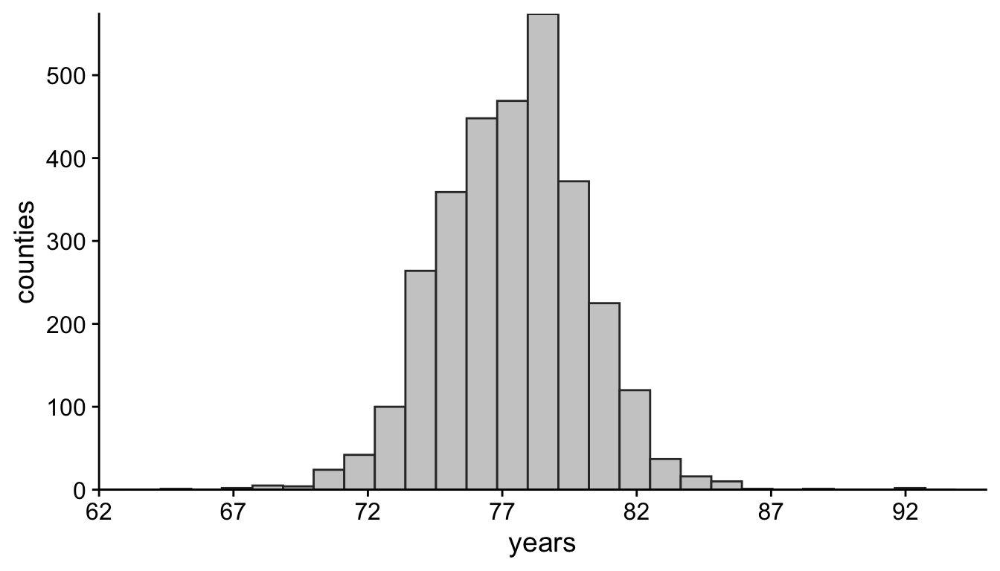
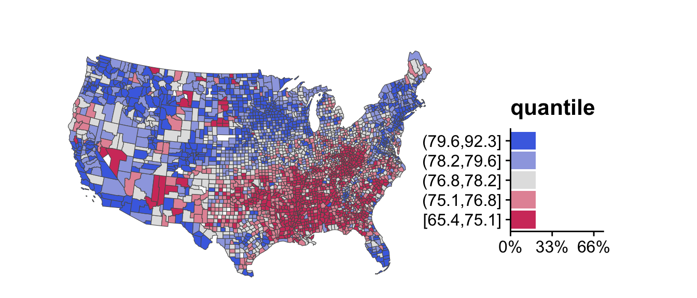
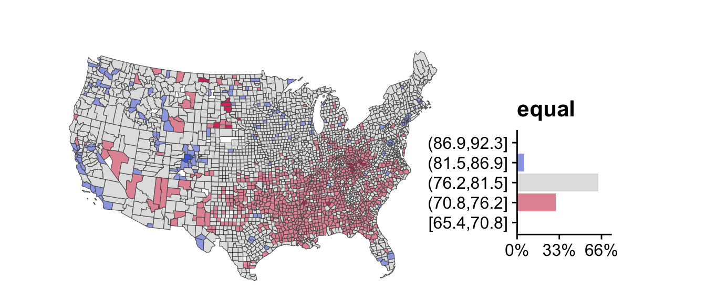
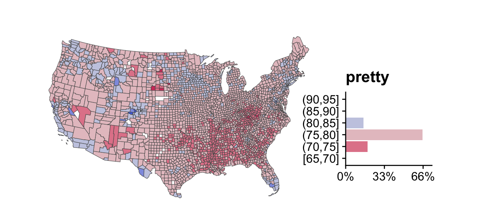
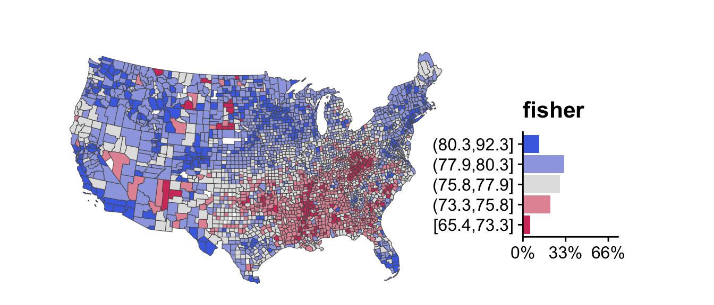
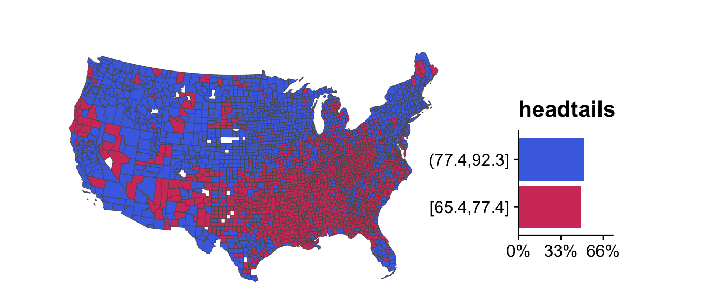
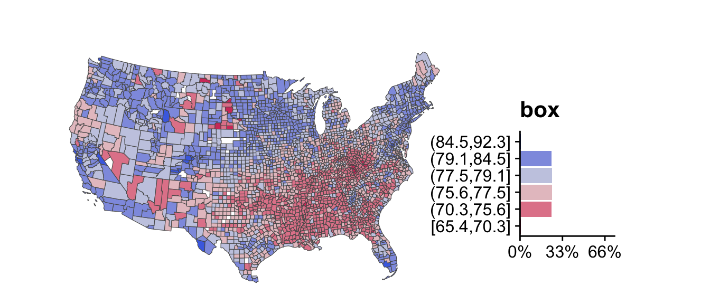

::: {.cell layout-align="center"}

```{.r .cell-code}
library(classInt)
library(colorspace)
library(cowplot)
library(dplyr)
library(ggplot2)
library(magrittr)
library(kableExtra)
library(sf)
```
:::


# Objective

The objective for this section is to cut a continuous variable into bins.  This is also referred to as "discretizing" the data.

# Introduction

How polygons of a choropleth map are colored is left to the subjective judgment of its creator. The color, in turn, is assigned to the polygon based upon which bin it is placed.  The number and breadth of the bins are determined manually by the creator or mathematically by an algorithm.  Some of the algorithms are simple; some are not. The conversion of a continuous variable into a discrete one is a common data science procedure.  The R-package universe offers at least three ways to discretize the data. A great way to begin is to review _R for Data Science_. [@wickham_data_2024] 

A common question about choropleths is how the polygons were assigned to a category.  An intimate knowledge of binning and classification methods will be required to respond in a helpful, credible way. Here, we'll review previous literature, discuss interval notation, explore helpful functions in R, show different intervals using a life expectancy example, and touch on the topic of precision.  

# Previous Research

## General

Early debates in cartography centered on whether mapping should be of a continuous or discrete variable.  The matter is largely resolved with consensus being in favor of discrete variables. [@schneider_criteriabased_2023] The next question is how many classifications are necessary. Some authors have suggested five to seven can be "well distinguished" and recalled. [@schneider_criteriabased_2023] Schneider and others [-@schneider_criteriabased_2023] advocated that the number of categories should be dependent on the underlying data and be chosen in a way to maximize insight. When choosing intervals, the most basic approaches divide the interval into equal lengths or place an equal number of observations into each bin. 

While easy to explain and interpret, these strategies overlook nuances in the distribution like skewness and clustering. [@schneider_criteriabased_2023] More sophisticated, mathematical algorithms exist to divide the interval.  The most common approach was proposed in statistics by W.D. Fisher [-@fisher_grouping_1958] and in geography by George Jenks [-@jenks_generalization_1963] . This approach  attempts to find the split of the data that minimizes the variance of points within each class [@schneider_criteriabased_2023; @brewer_evaluation_2002] For a description of George Jenks' impact in cartography, see [@mcmaster_history_2002].  McMasters and others [-@mcmaster_history_2002] proposed the following three criteria within the context of earthquake hazard maps:

> 1. *Likeness.* The classes in the classification scheme should contain all data that are alike, based on a quantitative measure, and should break apart data that are not alike.

> 2. *Sufficiency and completeness.* There should be enough (but not too many) scale breaks in order to be able to immediately see the primary patterns in the data.

> 3. *Signification.* Scale breaks should ideally signify meaningful values or changes in the distribution rather than arbitrarily selected values.

## Brewer and Pickle {#sec-brewer-pickle}

Brewer and Pickle [-@brewer_evaluation_2002] 
compared seven classification methods using responses from 55 Penn State students involving choropleth maps based on U.S. mortality data. An important part of this study was that the respondents were asked questions about individual maps and asked to make comparisons across series of maps.  Thus, common scales and coloring schemes aided interpretation when comparing multiple maps. Having previously used quantiles--a somewhat simplistic approach-- in the preparation of previous mortality maps, the authors were asked to revisit whether more sophisticated classification methods, like Fisher/Jenks, were more appropriate when looking at a series of maps. Stating that "the results may surprise cartographers", Brewer and Pickle [-@brewer_evaluation_2002] found that the simplest method —quantiles— trumped the other methods:

>“Quantiles seem to be one of the best methods for facilitating comparison as well as aiding general map-reading. The rational advantages of **careful optimization processes seem to offer no benefit over the simpler quantile method** for the general map-reading tasks” ([Brewer and Pickle, 2002, p. 679](zotero://select/library/items/4GKEJEFN)) ([pdf](zotero://open-pdf/library/items/VRA4PTMT?page=18&annotation=HNBGPZQU))

The authors expanded on their finding noting that there were hints throughout the cartographic literature that quantile methods are robust. The failure of other methods was ascribed to the middle classes holding a large portion of the data: boxplot and standard deviation having the largest portion of middle values. [@brewer_evaluation_2002]
 
 


::: {#tbl-brewer-results .cell layout-align="center" tbl-cap='Results from Brewer and Pickle [-@brewer_evaluation_2002]. Description edited for brevity.'}
::: {.cell-output-display}
`````{=html}
<table>
 <thead>
  <tr>
   <th style="text-align:left;"> Classification Method </th>
   <th style="text-align:left;"> Overall Accuracy </th>
   <th style="text-align:left;"> Description </th>
  </tr>
 </thead>
<tbody>
  <tr>
   <td style="text-align:left;"> Quantile </td>
   <td style="text-align:left;"> 75.6% </td>
   <td style="text-align:left;"> The quantile method places equal numbers of observations into each class. For example, an interval cut into five classes would have twenty percent of the observations in each class. </td>
  </tr>
  <tr>
   <td style="text-align:left;"> Minimum Boundary Error </td>
   <td style="text-align:left;"> 72.6% </td>
   <td style="text-align:left;"> The minimum-boundary-error method is an iterative optimizing method. The spatial distribution or topology of the observations is considered, rather than their statistical distribution. </td>
  </tr>
  <tr>
   <td style="text-align:left;"> Natural Breaks (Jenks) </td>
   <td style="text-align:left;"> 69.9% </td>
   <td style="text-align:left;"> The natural-breaks method is the implementation of the Jenks optimization procedure. The optimization minimized within-class variance and maximized between-class variance in an iterative series of calculations. </td>
  </tr>
  <tr>
   <td style="text-align:left;"> Hybrid equal interval </td>
   <td style="text-align:left;"> 69.4% </td>
   <td style="text-align:left;"> The hybrid equal interval classification that was developed used the upper whisker of a box plot to define the highest category of outliers. The remaining range of the data below the upper whisker was divided into equal intervals. </td>
  </tr>
  <tr>
   <td style="text-align:left;"> Standard deviation </td>
   <td style="text-align:left;"> 67.6% </td>
   <td style="text-align:left;"> The standard deviation classification had a middle class centered on the mean with a range of 1 standard deviation (0.5 standard deviation to either side of the mean). Classes above and below this mean class were also one standard deviation in range, from (0.5 to 1.5) standard deviations. The high and low classes contained remaining data that fell outside 1.5 standard deviations. </td>
  </tr>
  <tr>
   <td style="text-align:left;"> Shared area </td>
   <td style="text-align:left;"> 66.4% </td>
   <td style="text-align:left;"> The shared-area method used an ordered list of polygons ranked by data value to accumulate specific land areas in each class. With five classes, the extreme classes each covered ten percent of the map area. </td>
  </tr>
  <tr>
   <td style="text-align:left;"> Box plot </td>
   <td style="text-align:left;"> 64.6% </td>
   <td style="text-align:left;"> The box-plot-based method had a middle class containing data in the interquartile range (the middle 50 percent of the data straddling the median). The adjacent classes extended from the hinges of the box plot to the whiskers, and the extreme classes contained outside and extreme values beyond the whiskers. </td>
  </tr>
</tbody>
</table>

`````
:::
:::


# Intervals

Intervals are easy if the distinction between the brackett `[` and the parentheses `(` are remembered. In math, a _real interval_ is the set of all numbers lying between two endpoints.  An interval can contain neither endpoint, one endpoint or both endpoints.  An _open interval_ contains no endpoints and is denoted with parentheses. To illustrate, an open interval defined as `(0, 1)` includes all values greater than 0 and less than 1.  

A _closed interval_ contains both endpoints and is denoted by brackets.  A closed interval defined as `[0, 1]` includes 0, all values between 0 and 1, and 1.  The endpoints are included when the bracket is used.  Brackets and parentheses can be used together, and often are, when defining multiple breaks.  An interval is said to _left-closed_ when a bracket is used on the left, i.e., `[0, 1)` and _right-closed_ when a bracket is on the right, i.e., `(0, 1]`). 

`R` will often return multiple intervals as breaks. For example, `[0, 1] (1, 2]` means all values from and including 0 up to and including 1 are assigned to the first break while all values above 1 and up to and including 2 are assigned to the second break.

# Functions

The first function for discussion is the `cut()` function in the base package; the second function is the family of `cut_*()` functions in the `ggplot2` package; and the third is the `classIntervals()` function in the `classInt` package.

## `cut()`

The `base` package includes the `cut()` function. Many of the gritty details of the `cut()` function are inspected since it is the foundation for the other functions. The arguments to the `cut()` function can be used in the `ggplot2` version too. Aside from the object to be segmented, the function contains five arguments:

1. `breaks`
2. `labels`
3. `include.lowest`
4. `right`
5. `ordered_result`

Assuming the `labels` argument is unspecified, the factor level labels will read `(b1, b2] (b2, b3]`, where **b** is for break.  Here, all numbers greater than "b1" up to and including "b2" will be in the first break while all numbers greater than "b2" and up to and including "b3" will be in the second break.  If `ordered_result = T`, then the factor level labels will read `(b1, b2] < (b2, b3]`. The numbers in the first break are less than the numbers in the second break.

Let's begin with a continuous array of five numbers arranged from 99 to 102. Pay special attention to the end points 99 and 102 to see which interval, if at all, they are assigned.


::: {.cell layout-align="center"}

```{.r .cell-code}
(numbers <- c(99, 99.5:101.5, 102))
#> [1]  99.0  99.5 100.5 101.5 102.0
```
:::


`breaks` can either be a single number for the number of bins or a vector of cut points. Below, each number is assigned to one of three intervals. 99 is assigned to the first interval, while 102 is assigned to the last.


::: {.cell layout-align="center"}

```{.r .cell-code}
cut(numbers, breaks = 3)
#> [1] (99,100]  (99,100]  (100,101] (101,102] (101,102]
#> Levels: (99,100] (100,101] (101,102]
```
:::


The breaks or cut points can be explicitly set. Where the breaks are set the number 99 is set to `NA`. This would seem to be handled inconsistently.


::: {.cell layout-align="center"}

```{.r .cell-code}
cut(numbers, breaks = 99:102)
#> [1] <NA>      (99,100]  (100,101] (101,102] (101,102]
#> Levels: (99,100] (100,101] (101,102]
```
:::


However, the `cut()` details section states that, in the case of a single number, the outer limits are "moved away by 0.1% of the range to ensure that the extreme values both fall within the break intervals." Thus, 99 was included where `breaks = 3`, but set to `NA` when set explicitly. 
Where a number is outside the intervals, then it is set to `NA` as are `NaN` and `Inf`.


::: {.cell layout-align="center"}

```{.r .cell-code}
cut(c(NA, NaN, Inf, -Inf, numbers, 104), breaks = 99:102)
#>  [1] <NA>      <NA>      <NA>      <NA>      <NA>      (99,100]  (100,101]
#>  [8] (101,102] (101,102] <NA>     
#> Levels: (99,100] (100,101] (101,102]
```
:::


If the lowest value in the sequence is equal to the first break point, it can be included by specifying `include.lowest = T`. Note that the lowest value is no longer set to `NA`, but the first interval and it begins with a `[`.


::: {.cell layout-align="center"}

```{.r .cell-code}
cut(numbers, breaks = 99:102, include.lowest = T)
#> [1] [99,100]  [99,100]  (100,101] (101,102] (101,102]
#> Levels: [99,100] (100,101] (101,102]
```
:::


The interval's endpoints can be reversed by change the default behavior from `right = T` to `right = F`.


::: {.cell layout-align="center"}

```{.r .cell-code}
# default
cut(numbers, breaks = 99:102, include.lowest = T, right = T)
#> [1] [99,100]  [99,100]  (100,101] (101,102] (101,102]
#> Levels: [99,100] (100,101] (101,102]
```
:::


Notice that the brackets above have changed from `(100,101]` above to `[100,101)` below.


::: {.cell layout-align="center"}

```{.r .cell-code}
# not default
cut(numbers, breaks = 99:102, include.lowest = T, right = F)
#> [1] [99,100)  [99,100)  [100,101) [101,102] [101,102]
#> Levels: [99,100) [100,101) [101,102]
```
:::


Finally, labels will be added.


::: {.cell layout-align="center"}

```{.r .cell-code}
cut(numbers, 
    breaks = 99:102,
    include.lowest = T,
    labels = c("low", "avg", "high"))
#> [1] low  low  avg  high high
#> Levels: low avg high
```
:::


##  `cut_*()`

`ggplot` contains three functions to bin data: 

- `cut_interval()` makes `n` groups with equal range
- `cut_number()` makes `n` groups with equal numbers of observations
- `cut_width()` makes groups of a set width

Rather than using an array like in the preceding section, the `ggplot2` functions will be illustrated using a tibble/dataframe as this will likely mimic the common workflow.


::: {.cell layout-align="center"}

```{.r .cell-code}
(dt <- tibble::tibble(numbers = numbers))
#> # A tibble: 5 × 1
#>   numbers
#>     <dbl>
#> 1    99  
#> 2    99.5
#> 3   100. 
#> 4   102. 
#> 5   102
```
:::


Below each column illustrates one of the `ggplot2::cut_*()` functions.


::: {.cell layout-align="center"}

```{.r .cell-code}
dt %>% 
    mutate(eq_range = cut_interval(numbers, n = 3)) %>% 
    mutate(eq_number = cut_number(numbers, n = 3)) %>% 
    mutate(width = cut_width(numbers, width = 1)) %>% 
    mutate(labels = cut_width(numbers, width = 1, 
                              labels = c("a", "b","c", "d"))) %>% 
    kableExtra::kbl()
```

::: {.cell-output-display}
`````{=html}
<table>
 <thead>
  <tr>
   <th style="text-align:right;"> numbers </th>
   <th style="text-align:left;"> eq_range </th>
   <th style="text-align:left;"> eq_number </th>
   <th style="text-align:left;"> width </th>
   <th style="text-align:left;"> labels </th>
  </tr>
 </thead>
<tbody>
  <tr>
   <td style="text-align:right;"> 99.0 </td>
   <td style="text-align:left;"> [99,100] </td>
   <td style="text-align:left;"> [99,99.8] </td>
   <td style="text-align:left;"> [98.5,99.5] </td>
   <td style="text-align:left;"> a </td>
  </tr>
  <tr>
   <td style="text-align:right;"> 99.5 </td>
   <td style="text-align:left;"> [99,100] </td>
   <td style="text-align:left;"> [99,99.8] </td>
   <td style="text-align:left;"> [98.5,99.5] </td>
   <td style="text-align:left;"> a </td>
  </tr>
  <tr>
   <td style="text-align:right;"> 100.5 </td>
   <td style="text-align:left;"> (100,101] </td>
   <td style="text-align:left;"> (99.8,101] </td>
   <td style="text-align:left;"> (99.5,100.5] </td>
   <td style="text-align:left;"> b </td>
  </tr>
  <tr>
   <td style="text-align:right;"> 101.5 </td>
   <td style="text-align:left;"> (101,102] </td>
   <td style="text-align:left;"> (101,102] </td>
   <td style="text-align:left;"> (100.5,101.5] </td>
   <td style="text-align:left;"> c </td>
  </tr>
  <tr>
   <td style="text-align:right;"> 102.0 </td>
   <td style="text-align:left;"> (101,102] </td>
   <td style="text-align:left;"> (101,102] </td>
   <td style="text-align:left;"> (101.5,102.5] </td>
   <td style="text-align:left;"> d </td>
  </tr>
</tbody>
</table>

`````
:::
:::


## `classIntervals()`

The `classInt` package includes the `classIntervals()` function. According to the documentation, it "provides a uniform interface to finding class intervals for continuous numerical variables" and can be used to choose colors and symbols. The styles available to cut the interval include "fixed", "sd", "equal", "pretty", "quantile", "kmeans", "hclust", "bclust", "fisher", "jenks", "dpih", "headtails", "maximum", or "box". 

# Life Expectancy

The publisher for the life expectancy data is the Institute of Health Metrics and Evaluation in Seattle, Washington. [@imhe_mortality_2023] The data was winnowed to include all gender, all race life expectancy of U.S. residents at less than one year of age, excluding Alaska and Hawaii.  Before building the choropleth map, the overall life expectancy distibution will be examined. The average life expectancy is 77.41 years so the x-axis was labeled so that 77 was demarcated.


::: {.cell layout-align="center"}
::: {.cell-output-display}
{#fig-2019-us-life-exp-by-bounty fig-align='center' fig-pos='t' width=672}
:::
:::


Because the methods that `ggplot2` uses to cut an interval are duplicated in the `classInt` package, only the functions in the `classInt` package will be plotted. Five bins were created.  Some of the methods did not produce sufficient contrast as to be helpful and were dropped.


::: {.cell layout-align="center"}

:::


## Quantiles

The "quantile" style provides quantile breaks; arguments to quantile may be passed through the function.  This style is the equivalent to the `ggplot2::cut_number()` function.  If the reader will recall, this style was also the highest performing algorithm in Brewer and Pickle [-@brewer_evaluation_2002] in @tbl-brewer-results.


::: {.cell layout-align="center"}
::: {.cell-output-display}
{#fig-life-exp-quantiles fig-align='center' fig-pos='t' width=100%}
:::
:::


## Equal

The "equal" style divides the range of the variable into n parts. The equivalent in `ggplot2` is the `cut_interval()` function.  As opposed to the vibrant and contrasting colors in the quantiles plot above, the "equal" style looks flat.  The reason is that the bulk of the observations are clustered in the middle. This was a problem described in the Brewer and Pickle study [-@brewer_evaluation_2002].


::: {.cell layout-align="center"}
::: {.cell-output-display}
{#fig-life-exp-equal fig-align='center' fig-pos='t' width=100%}
:::
:::


## Pretty

The "pretty" style chooses a number of breaks not necessarily equal to `n` using pretty, but likely to be legible; arguments to pretty may be passed through. While the legend breaks are pretty due to rounding, the colors are flat since the observations clustered in the `(80, 75]` breaks.


::: {.cell layout-align="center"}
::: {.cell-output-display}
{#fig-life-exp-pretty fig-align='center' fig-pos='t' width=100%}
:::
:::


## Fisher-Jenks

Use the "fisher" style in the `classInterval()` function.  There is confusion around the "jenks" algorithm because of its opaque origin and the convuluted code associated with it. [@charlton_choropleth_2016] The confusion persists because the "jenks" algorithm is the default option for choropleths in commercial mapping software.  Interestingly, George Jenks himself was not confused stating, 

> It is the author's view that the Fisher algorithm is the best external grouping technique.  The algorithm was first proposed by W.D. Fisher in a paper entitled, "On Grouping for Maximum Homogeneity." [@jenks_optimal_1977]

The good news is that either algorithm produces an attractive plot and has been widely used for decades.


::: {.cell layout-align="center"}
::: {.cell-output-display}
{#fig-life-exp-fisher fig-align='center' fig-pos='t' width=100%}
:::
:::


## Headtails

The "headtails" style uses the algorithm proposed by Bin Jiang [-@jiang_head_2013], in order to find groupings or hierarchy for data with a heavy-tailed distribution. This classification scheme partitions all of the data values around the mean into two parts and continues the process iteratively for the values (above the mean) in the head until the head part values are no longer heavy-tailed distributed. 


::: {.cell layout-align="center"}
::: {.cell-output-display}
{#fig-life-exp-headtails fig-align='center' fig-pos='t' width=100%}
:::
:::


## Box

The "box" style generates 7 breaks (therefore 6 categories) based on a box-and-whisker plot. First and last categories include the data values considered as outliers, and the four remaining categories are defined by the percentiles 25, 50 and 75 of the data distribution. By default, the identification of outliers is based on the interquantile range (IQR), so values lower than percentile 25 - 1.5 * IQR or higher than percentile 75 + 1.5 * IQR are considered as outliers.


::: {.cell layout-align="center"}
::: {.cell-output-display}
{#fig-life-exp-box fig-align='center' fig-pos='t' width=100%}
:::
:::


# Precision

Much has been written about precision.  Readers have difficulty remembering results when more than one digit is included after the decimal.  "1.1%" is preferred to "1.11111%".  One study looked at the way authors presented percentages in academic journals.  Of the 43,000 reported percents, authors used too many decimal places 33% of the time and too few 12% of the time. [@barnett_missing_2018] Choosing the number of significant digits to report can be subjective; however, helpful guidelines exist. [@cole_too_2015] Reporting standards differ by profession, style guide, and statistical context.  Here, the context is to assign polygons to one of, perhaps, six bins and include a helpful legend. The cramped space of a map legend is a poor place to demonstrate precision to the _nth_ place.  The `dig.lab` argument within the `cut` function can be set to zero or one. The default is three.

# Key Points

- Plot a histogram of the variable to be segmented

- Use no fewer than 4 nor more than 7 bins without a good reason

- For normally distributed data that requires comparisons between different maps, use the "quantiles" method

- For non-normal distributions, use the "quantiles" method and compare it to an optimal classification method like "fisher" or "headtails"

- Consider keeping no more than one digit after the decimal place in the legend

- Relabel the factor variable only at the very end of the project

- If after discreting the data, the number of `NA`s increases, you should inspect the data further to determine its cause

<hr>
:::{#refs-plotting-016-rspatial}
:::
:::{#refs-plotting-016-packages}
:::

